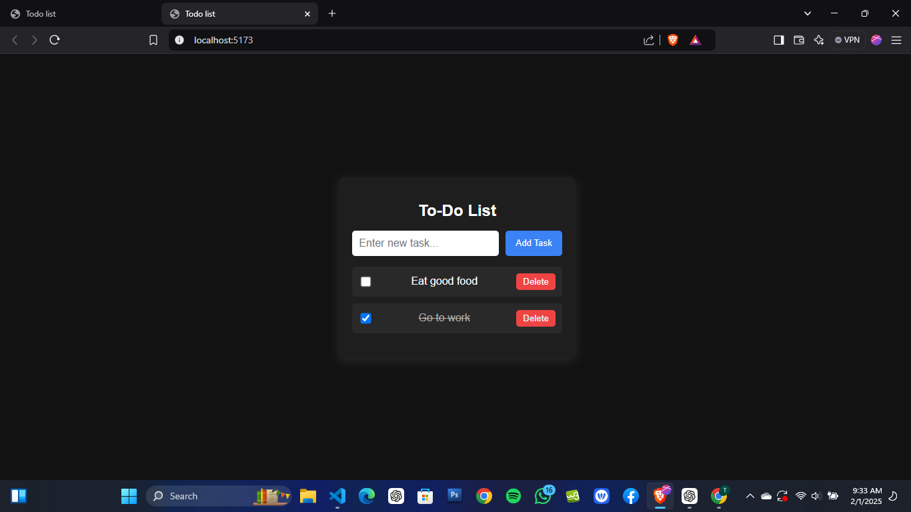

# 📝 To-Do List App

A simple and responsive **To-Do List** built with **React.js**.  
This app allows users to **add, complete, and delete tasks**, with data stored in **Local Storage** so tasks remain after a page refresh.

## 🚀 Features

-   ✅ **Add Tasks** – Users can add new tasks.
-   ✅ **Mark as Completed** – Clicking on a checkbox strikes through completed tasks.
-   ✅ **Delete Tasks** – Remove unwanted tasks from the list.
-   ✅ **Local Storage Support** – Tasks are saved even after refreshing the page.
-   ✅ **Responsive Design** – Mobile-friendly UI with modern styling.

## 🎨 UI Preview



## 🛠️ Technologies Used

-   **React.js** (Functional Components, Hooks)
-   **Local Storage** (for persistent data)
-   **CSS3** (Flexbox, responsive design)
-   **JavaScript (ES6+)**

## 👨‍💻 Author

**Obayomi Taofeek**  
GitHub: [Tobless-Scripts](https://github.com/Tobless-Scripts)  
Twitter: [@ObayomiTaofeek](https://x.com/ObayomiTaofeek?t=KIEUtHE837O7ZRa2TNu5sQ&s=09)

## ⭐ Star the Repository

If you find this project helpful, **please star the repo** on GitHub to support the project! 🌟  
👉 [Star the repository](https://github.com/Tobless-Scripts/todo-app)

## 🛠️ Installation & Setup

To run this project locally, follow these steps:

### 1️⃣ Clone the repository:

```bash
git clone https://github.com/Tobless-Scripts/todo-app.git
cd todo-app
npm install
npm start
```

## Project Structure

-   📂 src
-   ┣ 📜 Todo.jsx # Main To-Do List component
-   ┣ 📜 Todo.css # Styles for the To-Do List
-   ┣ 📜 App.jsx # Root component
-   ┗ 📜 index.html # Entry point of the app

## 🌟 If you find this project helpful, don't forget to ⭐ star the repo!
